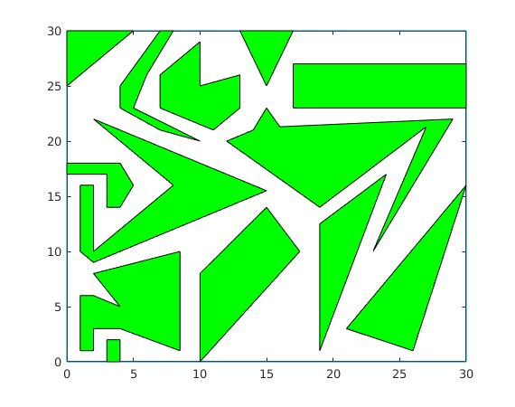

# Sampling-Based Mobile Robot Path Planning Algorithm by Dijkstra, Astar and Dynamic Programming

In this repository, we briefly presented full source code of Dijkstra, Astar, and Dynamic Programming approach to finding the best route from the starting node to the end node on the 2D graph. We also provide the main script which performs these algorithms on the given map.

## Map Definiton
We already provide a sample map creating in map_definition.m source code. We defined all closed polygon in that maps which shows the obstacles. In the sample map, there are 13 different obstacles whose edges are defined by given x and y coordinates. One sample is shown by followings;
```
map.pgx{1}=[2 8.5 8.5 4 2 2 1 1 2 4 2];
map.pgy{1}=[8 10 1 3 3 1 1 6 6 5 8];
```
You can add new obstacles or modify the given obstacle to create your own map. 

## Sampling-Based Path Planning
In sampling based method, we need to generate some certain number of points on to the map which falls into the unoccupied region of given map. Then we calculate which node has a connection to which nodes. By this way, we obtain the undirected graph of generated random points. To generate that points, we can use some sophisticated method to distribute the nodes all around the map as clever as possible. But in that repository, we selected to generate them by just uniformly random. We generated 100 number of nodes which are in the free region of the map. there is the given map, generated nodes, and their connections.

<p align="center">
    
    
</p>

## Path Planning

We tested the mentioned algorithms performance some certain start and endpoint. Since we have 100 number of nodes in the graph, we added start and end points as 101st and 102th node in the map as following code and updated undirected graph.

```
startp=[5, 29];
endp=[29, 20];
```
Then we tested that 102 number of noded graph path planning via Dijkstra, Astar, and Dynamic Programming. Here are the all three methods' planned path and their costs.

<p align="center">
    
    
   
</p>

This provided demo is in main.m script. Please run that code directly.
